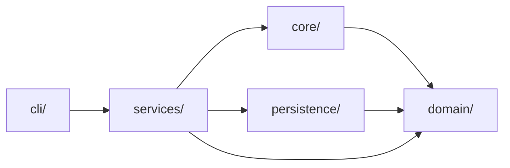
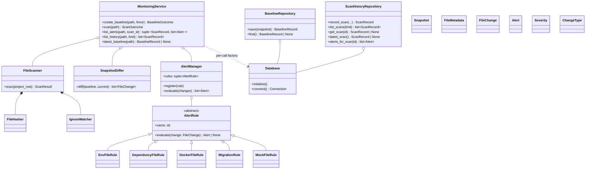
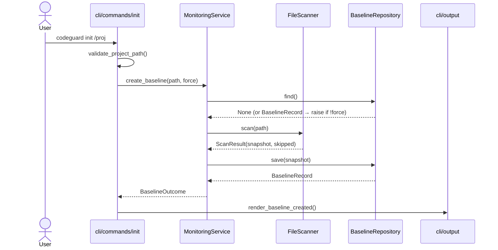
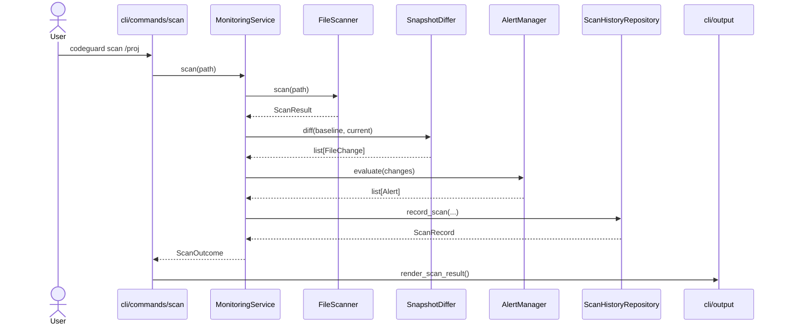
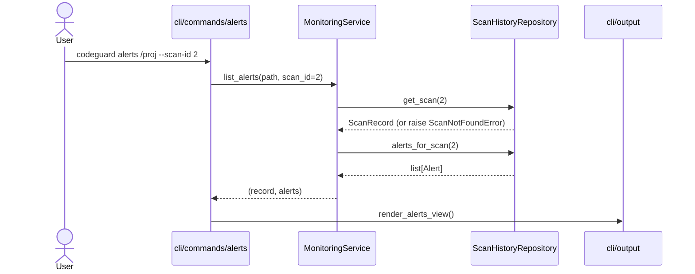

# CodeGuard — Architecture

This document covers the design of CodeGuard from a single point of view: how the layers fit together, where the OOP concepts live, and what happens when you run a command.

## 1. What CodeGuard is (and isn't)

CodeGuard snapshots the bytes of a project (file size, modification time, SHA-256) into a trusted baseline, then diffs later snapshots against it and runs each diff edge through a small set of rules that emit alerts.

It is **not**:

- a replacement for Git — Git tracks changes you make on purpose; CodeGuard watches the working tree against a trusted baseline and flags edits (committed or not) that you may not have meant to keep;
- a watcher / daemon — every operation is on-demand;
- a content-diff tool — the alert says *what file*, *what severity*, *what rule*; `git diff` is still where you read the lines.

Think of CodeGuard as a second, file-content–level trust anchor independent of Git history.

## 2. Layered architecture



Five layers, with strict inward-only dependencies:

| Layer | Owns | Forbidden imports |
|-------|------|-------------------|
| `domain/` | Pure data types: `Snapshot`, `FileMetadata`, `FileChange`, `ChangeType`, `Alert`, `Severity`. | Everything I/O. |
| `core/` | Scanner, hasher, ignore matcher, differ, alert rules + manager. | `persistence`, `cli`. |
| `persistence/` | SQLite `Database`, `BaselineRepository`, `ScanHistoryRepository`. | `cli`, `services`. |
| `services/` | `MonitoringService` facade + result types + service exceptions. | `cli`. |
| `cli/` | Typer app, commands, renderers. | `domain`, `core`, `persistence` — **only** `services` and CLI siblings. |

The CLI never reaches into the domain or persistence layers directly. That's the rule that keeps the service surface small enough to swap out — for tests, for a future REST adapter, or for a different storage backend.

## 3. Class diagram

Scoped to highlight the polymorphism showpiece (`AlertRule` hierarchy) and the composition spine (`MonitoringService` and the repositories). Domain dataclasses are shown as plain boxes.



## 4. OOP-concept map

| Concept | Where | Why this matters |
|---------|-------|------------------|
| **Inheritance** | `core/rules/base.py` (`AlertRule(ABC)`) + 5 concrete subclasses in `core/rules/`. | New rule = one new subclass. No edits to `AlertManager`, no central registry switch-statement. |
| **Polymorphism** | `core/rules/manager.py::AlertManager.evaluate` iterates `self._rules` and calls `rule.evaluate(change)` on each. No `isinstance` check. | The whole rule engine is one for-loop. Adding `MockFileRule` didn't touch `AlertManager`. |
| **Composition** | `MonitoringService.__init__` injects `FileScanner`, `SnapshotDiffer`, `AlertManager`, and a `database_factory`. `FileScanner` composes `FileHasher` + `IgnoreMatcher`. Repositories compose `Database`. | Constructor injection means every collaborator is replaceable in tests; the service has no static singletons. |
| **Encapsulation** | Private-by-convention attributes throughout (`_path`, `_initialized`, `_scanner`, `_rules`, `_logger`). Public surface goes through methods/properties. | Repositories never expose the SQLite connection; the service never exposes its database factory. The boundary holds. |
| **Association** | CLI commands instantiate `MonitoringService()` (constructor with all-defaults) and call its public methods only. | The CLI cannot reach the scanner or repositories directly — the service is the only seam. |
| **Abstract base class** | `AlertRule(ABC)` with `@abstractmethod evaluate(self, change) -> Alert \| None`. | Forces every rule to commit to the same contract. Trying to instantiate a rule that forgets `evaluate()` fails at class creation. |

## 5. Domain types

Everything in `domain/` is a frozen dataclass with `slots=True` (or a `str`-backed `Enum`):

- **`FileMetadata`** — `(relative_path, size_bytes, modified_at, sha256)`. The atomic identity of a file at a moment in time.
- **`Snapshot`** — `(project_root, files: dict[str, FileMetadata], created_at, snapshot_id)`. A keyed map of file metadata; what `FileScanner` produces.
- **`FileChange`** — `(relative_path, change_type, before, after)`. The diff edge. `__post_init__` enforces invariants: `CREATED` has `before is None`, `DELETED` has `after is None`, `MODIFIED` has both.
- **`ChangeType`** — `CREATED | MODIFIED | DELETED`.
- **`Alert`** — `(relative_path, change_type, severity, rule_name, message)`. What rules emit.
- **`Severity`** — `LOW | MEDIUM | HIGH | CRITICAL` with a `rank` property used for sorting.

The whole layer has zero I/O. Everything else builds on it.

## 6. Alert rules — the polymorphism beat

The contract is one method:

```python
class AlertRule(ABC):
    @abstractmethod
    def evaluate(self, change: FileChange) -> Alert | None: ...
```

Concrete rules:

| Rule | Trigger | Severity |
|------|---------|----------|
| `EnvFileRule` | `CREATED`, `MODIFIED`, or `DELETED` on `.env` / `.env.*` | `CRITICAL` |
| `DependencyFileRule` | `MODIFIED` on `requirements.txt`, `pyproject.toml`, `package.json`, `go.mod`, `go.sum` | `HIGH` |
| `DockerFileRule` | `MODIFIED` on `Dockerfile`, `docker-compose.{yml,yaml}` | `HIGH` |
| `MigrationRule` | `MODIFIED` or `DELETED` on any path inside `migrations/` (or `migration/`) | `HIGH` |
| `MockFileRule` | `MODIFIED` on `mock_*.{go,py}` / `*_mock.{go,py}` / files inside `mocks/` | `MEDIUM` |

`AlertManager.evaluate` walks every change against every rule and collects the non-`None` results — sorted by severity (descending) then path. Adding a sixth rule means writing one subclass; the manager never changes. That is the polymorphism win.

## 7. Persistence model

One SQLite database per project at `<project>/.codeguard/codeguard.db`. Schema (defined in `persistence/database.py`):

| Table | Purpose |
|-------|---------|
| `snapshots` | One row per scan + one row per baseline. Owns the `created_at` timestamp. |
| `file_metadata` | Files belonging to a snapshot. Unique on `(snapshot_id, relative_path)`. |
| `baselines` | The active baseline pointer (one row at most). |
| `scans` | Persisted scans. References both the baseline and the scan's snapshot. |
| `changes` | Diff edges produced during a scan. |
| `alerts` | Alerts produced during a scan. Indexed on `(scan_id, severity)`. |

Every foreign key uses `ON DELETE CASCADE`. Deleting a baseline atomically drops its scans, their changes, and their alerts — that's how `init --force` re-baselines safely without leaking history rows.

The schema is versioned via `PRAGMA user_version` (currently `1`). `Database.initialize()` stamps the version on a fresh database and refuses to open one written by an incompatible build, raising `SchemaVersionMismatchError`.

The two repositories own the SQL: `BaselineRepository` (save / find) and `ScanHistoryRepository` (record_scan / list_scans / latest_scan / get_scan / alerts_for_scan). Connections come from `Database.connect()` as a context manager that auto-commits on success and rolls back on exception.

## 8. Sequence diagrams

### 8.1 `codeguard init <path>`



### 8.2 `codeguard scan <path>` — the core narrative



The polymorphism call lives inside `AlertManager.evaluate`: it loops over the registered rules and calls `rule.evaluate(change)` regardless of which subclass it is.

### 8.3 `codeguard alerts <path>` — the read-only path



`status` and `history` are structurally similar to `alerts` — they read through the repositories and do not touch `FileScanner`, `SnapshotDiffer`, or `AlertManager` at all. Documenting them separately would not reveal anything new.

## 9. Exit codes & JSON output

| Code | When |
|------|------|
| `0` | Success. |
| `1` | Runtime error: SQLite error, unexpected exception. Logged to stderr with traceback when `--verbose` is on. |
| `2` | Invalid usage: bad path, missing baseline, scan not found, invalid option. The user can fix it. |
| `3` | CRITICAL alerts fired and the user passed `scan --fail-on-critical`. CI gate. |

Every command also takes `--json`: success and expected-failure output go to stdout as a JSON object; runtime errors stay on stderr regardless. The shape is stable per command and matches what the renderer in `cli/output.py` emits.

## 10. Out of scope (intentional)

- **No watch / daemon mode.** On-demand only.
- **No user-configurable rule files.** Rules live in `core/rules/`; adding one is a Python class, not a YAML schema.
- **No multi-project / global database.** One DB per project, isolated under `<project>/.codeguard/`.
- **No file-content diff display.** That's `git diff`'s job; CodeGuard reports the *fact* of the change and its severity.
