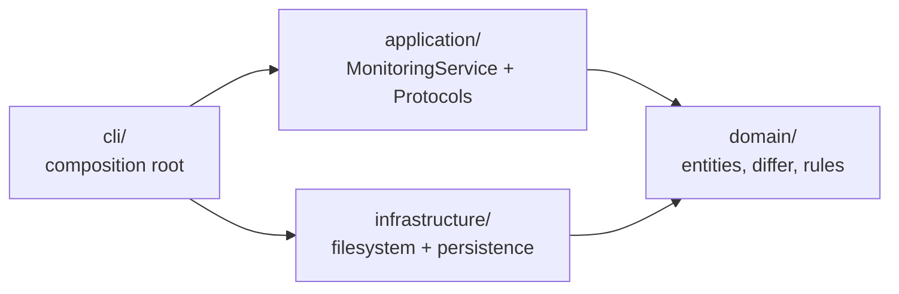
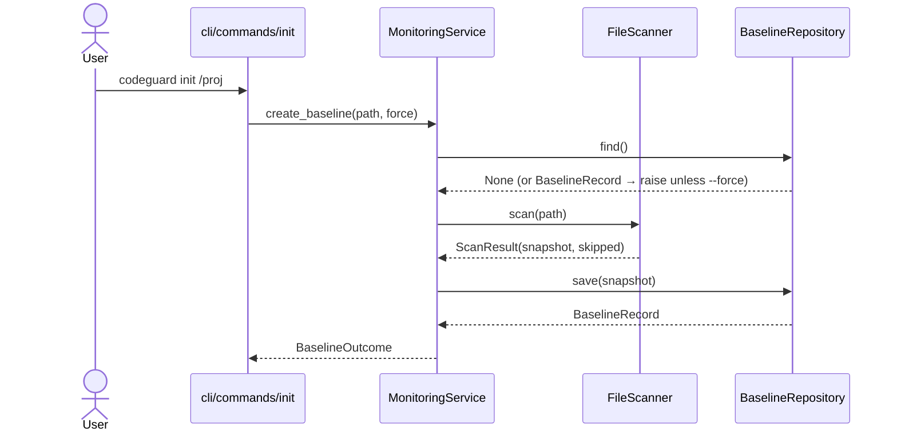
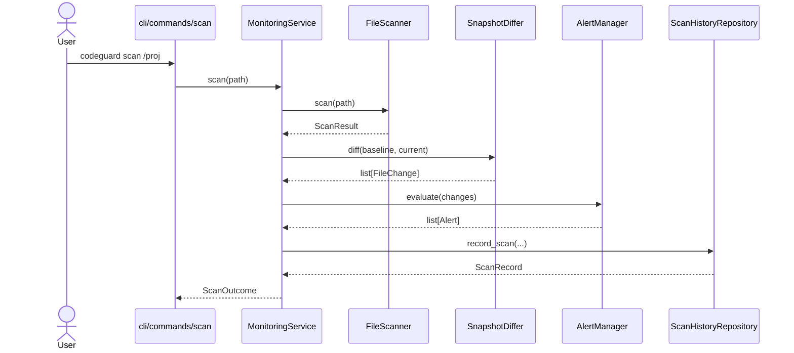

# CodeGuard — Architecture

CodeGuard is a CLI that snapshots a project's trusted state and reports unexpected changes against it. This document describes how the codebase is organised, where the core design choices live, and what happens when a command runs.

## 1. What CodeGuard is (and isn't)

CodeGuard records each tracked file's size, modification time, and SHA-256 in a per-project SQLite database, then compares later snapshots against that baseline. Each diff entry is run through a small set of rules that emit severity-tagged alerts. Six commands form the user surface: `init`, `review`, `scan`, `status`, `alerts`, and `history`.

It is **not**:

- A replacement for Git — Git records intentional history; CodeGuard watches the working tree against a trusted baseline and flags edits (committed or not) that may not have been intended.
- A watcher or daemon — every operation is on-demand.
- A content-diff tool — alerts identify *what file*, *what severity*, *what rule*; line-level diffs remain `git diff`'s job.

## 2. Architecture and dependency direction

CodeGuard follows Clean Architecture: dependencies flow inward, and the application layer depends on abstractions rather than concrete infrastructure.


```mermaid
flowchart LR
    cli[cli/<br/>composition root]
    app[application/<br/>MonitoringService + Protocols]
    infra[infrastructure/<br/>filesystem + persistence]
    dom[domain/<br/>entities, differ, rules]
    cli --> app
    cli --> infra
    app --> dom
    infra --> dom
```

| Layer | Owns | Forbidden imports |
|-------|------|-------------------|
| `domain/` | Entities (`Snapshot`, `FileMetadata`, `FileChange`, `Alert`, `Severity`), `SnapshotDiffer`, the `AlertRule` hierarchy and `AlertManager`. Pure: no I/O, no SQL. | Everything outward. |
| `application/` | `MonitoringService` (use-case façade), DTOs (`BaselineRecord`, `ScanRecord`, `ScanResult`), and Protocols (`BaselineRepositoryProtocol`, `ScanHistoryRepositoryProtocol`, `FileScannerProtocol`). | `infrastructure`, `cli`. |
| `infrastructure/` | I/O adapters under `infrastructure/filesystem/` (scanner, hasher, ignore matcher) and `infrastructure/persistence/` (`Database`, repositories). Each adapter satisfies an application Protocol structurally. | `application`, `cli`. |
| `cli/` | Typer app, commands, renderers, and `wiring.py` — the composition root that constructs the infrastructure adapters and injects them into `MonitoringService`. | None within the project; everything else flows through `application`. |

The application layer declares its persistence and scanning needs as `typing.Protocol` types in `application/ports.py`. The concrete repositories and `FileScanner` in `infrastructure/` satisfy those Protocols structurally — no inheritance required. `cli/wiring.py::build_monitoring_service` builds the adapters and hands them to `MonitoringService` at construction time. The application layer never imports `infrastructure`, which keeps the persistence backend and the filesystem implementation swappable and individually testable.

## 3. OOP concepts in the design

| Concept | Where it lives | What it buys us |
|---------|----------------|-----------------|
| **Inheritance** | `domain/rules/base.py` declares `AlertRule(ABC)`; `domain/rules/` adds five concrete subclasses. | Adding a rule means writing one class — no central registry to edit. |
| **Polymorphism** | `domain/rules/manager.py::AlertManager.evaluate` iterates over the registered rules and calls `rule.evaluate(change)`. No `isinstance` check. | The rule engine stays a single loop regardless of how many rules exist. |
| **Composition** | `MonitoringService` is constructed with its repositories and scanner. `FileScanner` composes `FileHasher` and `IgnoreMatcher`. Repositories compose `Database`. | Every collaborator is replaceable; nothing is reached through a global. |
| **Encapsulation** | Private-by-convention attributes (`_path`, `_rules`, `_db`, …); SQL is confined to the repository classes; the database connection is never exposed. | Layer boundaries hold; callers depend on intent, not on storage details. |
| **Abstraction** | `AlertRule(ABC)` plus `@abstractmethod evaluate`; `Database.connect()` exposed as a context manager. | The rule contract is enforced at class-creation time; transaction handling is centralised. |
| **Dependency inversion** | `application/ports.py` defines repository and scanner Protocols. `MonitoringService` depends on those Protocols; concrete implementations in `infrastructure/` satisfy them structurally. `cli/wiring.py` is the only place where the two layers meet. | The application layer is testable with in-memory fakes and is unaware of SQLite or the filesystem. |

## 4. Domain types

Everything in `domain/` is a plain `@dataclass` (or a `str`-backed `Enum`). Validation lives in `__post_init__` where it applies:

- **`FileMetadata`** — `(relative_path, size_bytes, modified_at, sha256)`. The atomic identity of a file at a moment in time.
- **`Snapshot`** — `(project_root, files: dict[str, FileMetadata], created_at, snapshot_id)`. A keyed map of file metadata; what `FileScanner` produces.
- **`FileChange`** — `(relative_path, change_type, before, after)`. The diff edge. `__post_init__` enforces invariants: `CREATED` has `before is None`, `DELETED` has `after is None`, `MODIFIED` has both.
- **`ChangeType`** — `CREATED | MODIFIED | DELETED`.
- **`Alert`** — `(relative_path, change_type, severity, rule_name, message)`. What rules emit.
- **`Severity`** — `LOW | MEDIUM | HIGH | CRITICAL` with a `rank` property used for sorting.

The whole layer has zero I/O.

## 5. Alert rules

The rule contract is one method:

```python
class AlertRule(ABC):
    @abstractmethod
    def evaluate(self, change: FileChange) -> Alert | None: ...
```

Concrete rules:

| Rule | Trigger | Severity |
|------|---------|----------|
| `EnvFileRule` | `CREATED`, `MODIFIED`, or `DELETED` on `.env` / `.env.*` | `CRITICAL` |
| `DependencyFileRule` | `MODIFIED` on `requirements.txt`, `pyproject.toml`, `package.json`, `go.mod`, `go.sum` | `HIGH` |
| `DockerFileRule` | `MODIFIED` on `Dockerfile`, `docker-compose.{yml,yaml}` | `HIGH` |
| `MigrationRule` | `MODIFIED` or `DELETED` on any path inside `migrations/` (or `migration/`) | `HIGH` |
| `MockFileRule` | `MODIFIED` on `mock_*.{go,py}` / `*_mock.{go,py}` / files inside `mocks/` | `MEDIUM` |

`AlertManager.evaluate` walks every change against every rule and collects the non-`None` results, sorted by severity (descending) then path. Adding a sixth rule means writing one subclass; the manager does not change.

## 6. Main flows

### `codeguard init <path>`


```mermaid
sequenceDiagram
    actor User
    participant CLI as cli/commands/init
    participant Svc as MonitoringService
    participant Scn as FileScanner
    participant Br as BaselineRepository

    User->>CLI: codeguard init /proj
    CLI->>Svc: create_baseline(path, force)
    Svc->>Br: find()
    Br-->>Svc: None (or BaselineRecord → raise unless --force)
    Svc->>Scn: scan(path)
    Scn-->>Svc: ScanResult(snapshot, skipped)
    Svc->>Br: save(snapshot)
    Br-->>Svc: BaselineRecord
    Svc-->>CLI: BaselineOutcome
```

### `codeguard scan <path>`


```mermaid
sequenceDiagram
    actor User
    participant CLI as cli/commands/scan
    participant Svc as MonitoringService
    participant Scn as FileScanner
    participant Diff as SnapshotDiffer
    participant AM as AlertManager
    participant Hr as ScanHistoryRepository

    User->>CLI: codeguard scan /proj
    CLI->>Svc: scan(path)
    Svc->>Scn: scan(path)
    Scn-->>Svc: ScanResult
    Svc->>Diff: diff(baseline, current)
    Diff-->>Svc: list[FileChange]
    Svc->>AM: evaluate(changes)
    AM-->>Svc: list[Alert]
    Svc->>Hr: record_scan(...)
    Hr-->>Svc: ScanRecord
    Svc-->>CLI: ScanOutcome
```

`AlertManager.evaluate` is where polymorphic dispatch happens: each registered rule is invoked through the abstract `evaluate` method, regardless of its concrete subclass.

The remaining commands — `status`, `history`, `alerts`, and `review` — read through the same repositories without invoking `FileScanner`, `SnapshotDiffer`, or `AlertManager` (with the exception of `review`, which is a `scan` followed by a prioritised renderer).

## 7. Persistence model

One SQLite database per project at `<project>/.codeguard/codeguard.db`. The schema is defined in `infrastructure/persistence/database.py`:

| Table | Purpose |
|-------|---------|
| `snapshots` | One row per scan and one per baseline. Owns the `created_at` timestamp. |
| `file_metadata` | Files belonging to a snapshot. Unique on `(snapshot_id, relative_path)`. |
| `baselines` | The active baseline pointer (one row at most). |
| `scans` | Persisted scans. References both the baseline and the scan's snapshot. |
| `changes` | Diff edges produced during a scan. |
| `alerts` | Alerts produced during a scan. Indexed on `(scan_id, severity)`. |

Every foreign key uses `ON DELETE CASCADE`, so deleting a baseline atomically drops its scans, changes, and alerts — that's how `init --force` re-baselines safely without leaking history rows.

Two repositories own the SQL — `BaselineRepository` (`save`, `find`) and `ScanHistoryRepository` (`record_scan`, `list_scans`, `latest_scan`, `get_scan`, `alerts_for_scan`). Connections come from `Database.connect()`, a context manager that commits on success and rolls back on exception.

## 8. Exit codes and JSON output

| Code | When |
|------|------|
| `0` | Success. |
| `1` | Runtime error: SQLite error or unexpected exception. |
| `2` | Invalid usage: bad path, missing baseline, scan not found, invalid option. |
| `3` | CRITICAL alerts fired and `scan --fail-on-critical` (or `review --fail-on-critical`) was passed. |

Every command accepts `--json`: success and expected-failure output go to stdout as a JSON object; runtime errors stay on stderr regardless. The shape is stable per command and matches what `cli/output.py` emits.

## 9. Out of scope

- **No watch / daemon mode.** Operations are on-demand; a future event-loop watcher and TUI dashboard are deferred.
- **No user-configurable rule files.** Rules live in `domain/rules/`; adding one is a Python class, not a YAML schema.
- **No multi-project / global database.** One database per project, isolated under `<project>/.codeguard/`.
- **No file-content diff display.** That's `git diff`'s job; CodeGuard reports the *fact* of a change and its severity.
